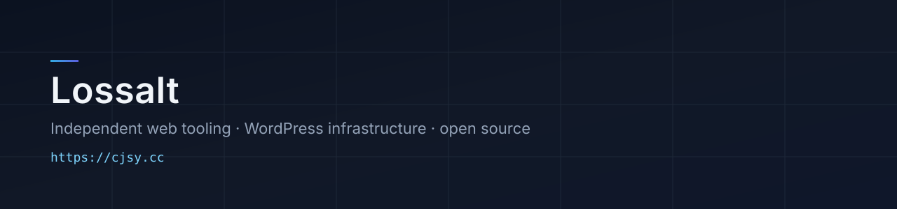

  

  
  
  
  
  

个人站点 **[cjsy.cc](https://cjsy.cc/)** · 喜欢研究技术的普通人

---

### 我的理念

- **引用和存储解耦**：文章里写稳定的名字，图和文件可以搬走、换机器、换域名  
- **小而专**：一个接口只解决一个问题，能被读懂、能被复用  
- **走完整流程**：改动要能进主线——测试、审查、合并，而不是本地改完就算  

---

### 我目前的学习方向

- WordPress 主题与资源链路（媒体、迁移、多语言）  
- PHP / Python 小服务的可维护写法  
- 开源协作：分支、PR、Code Review、长期跟进上游  

---

### 我的项目

- **[article-image](https://github.com/Lossalt/article-image)** — 可搬迁图床命名入口。正文写 `?res=名字`，迁站只改 `base_url`  
- **[random-img](https://github.com/Lossalt/random-img)** — 随机壁纸接口。桌面 / 手机图池，支持跳转、直出、JSON  
- **[iptv-gen](https://github.com/Lossalt/iptv-gen)** — IPTV 播放列表生成：多源采集、测活、排序、导出  

---

### 我参与的项目

- **[Myriad](https://github.com/Myriad-You/Myriad)** — 首个已合并 PR：[zh-TW 机器人配对文案](https://github.com/Myriad-You/Myriad/pull/585)（约 60 条，已 merge）  
- **[Sakurairo](https://github.com/mirai-mamori/Sakurairo)** — WordPress 主题 fork，准备继续贡献  

---

### 联系

- 网站：[cjsy.cc](https://cjsy.cc/)  
- GitHub：[@Lossalt](https://github.com/Lossalt)

---

Lossalt

